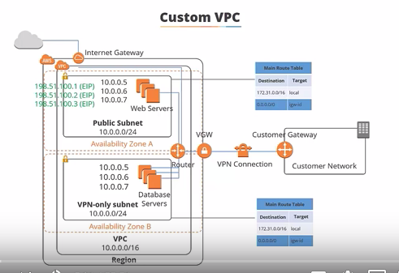
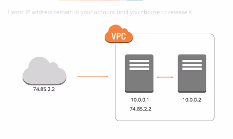
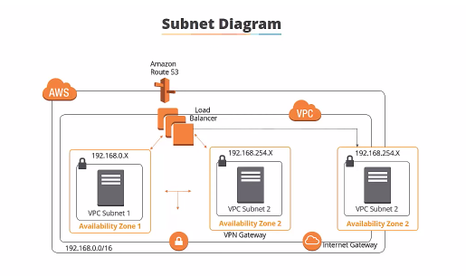
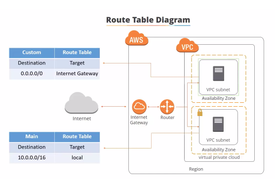
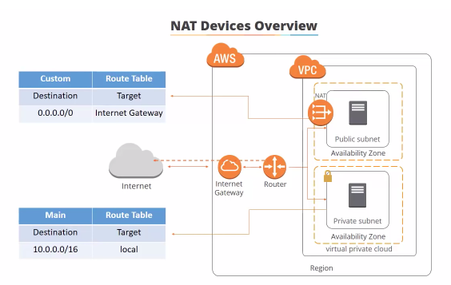

Tutorial: https://www.youtube.com/watch?v=fpxDGU2KdkA&list=PLEiEAq2VkUULlNtIFhEQHo8gacvme35rz&index=11&t=172s


## Create a VPC: Virtual Private Cloud

VPC: It allows to enable AWS resources into a virtual private network  that you define

```
    Nametag: RonalTestinVPC
    CIDR: 10.0.0.0/16
    Tenancy: Default 
```
Note: Tenancy -> Dedicate is better in case of performance but some charge might be applied.
    Subnets must be associated to a VPC.






### Create Subnets

We can create two subnets one public and other private depends on the purpose of the subnet. Public can be set up for resources that need internet access (Eg. Web Server), but if not, it is better to assign to a private subnet (E.g. a DataBase). 

Note: It  is better to set up in different availability zone in order to avoid failover, and to have redundancy. 

For the example, it was created two subnets the first one was the public and the configuration was the following: 

```
   NameTag: 10.0.1.0_EAST_US_2B_RonalTest_PUB
   VPC: RonalTestingVPC   -> VPC created in advance
   AvailabilityZone: US_East_2b
   IPv4 CIDR: 10.0.1.0/24  -> 256 IP available
```

Then the Private subnet, in this case I changed the Availability Zone and the CIDR

```
   NameTag: 10.0.2.0_EAST_US_2B_RonalTest_PUB
   VPC: RonalTestingVPC   -> VPC created in advance
   AvailabilityZone: US_East_2a
   IPv4 CIDR: 10.0.2.0/24  -> 256 IP available
```




### Internet Gateway

It is a horizontally scaled, redundant, and high available VPC component that allows communication between instances in your VPC and the internet. It can be attached one internet gateway by VPC.

It is assigned a name to the IGW, for example RonalTest_IGW then it appears as deatached. We must associate it with the VPC created. 

But before to an instance has an Internet Access we need to ensure that the subnet root point to the intenat gateway. 

### Create a Route Table 

The Subnet must be associated with a Route Table. It must be created using the following parameters:

```
NameTag: RonalTesting_RT
VPC: RonalTesting_VPC
```

Then, it must be included the route. It is done in the Route Panel and then it must be created the association with the Internet Gateway. We have to add rooute with the following info

```
Destination      Target
0.0.0.0/0      RonalTestinIGW
````

Then, the public subnet has to be asssociated with the IGW in order to have internet access. To perform this, we have to click on subnet association and select the subnet which will have internet access. In our example the Public Subnet.



### NAT Gateway

It allows to access the private subnet to have access to Internet. This must be configurated in the Public Subnet and this is encharge to give access. It translates the IP address to the private instance.

There are two kinds of Nat Devices:


To set up the Nat Gateway

We have to search the id of the public subnet and create a new nat gateway. In this point we have to include

```
Subnet: ID to the public 
Elastic IP: X.X.X.X IP associated 
```

To use it, we have to associate in the route table in order to target in on a that gateway. 

Note: The RonalTesting_RT_Main was created automatycally using the default configuration. 

In this point we have to search it and not to confuse with the RonalTesting_RT that point out to the public subnet. 

In this case, we have to route to the RonalTesting_RT_Main and  the private is associated by default. For this reason, we have to route using the edit botton and add the following:

```
Destination      Target
0.0.0.0/0      RonalTestinNat
````

Note: Se tiene que asociar al nat que se ha configurado previamente.




