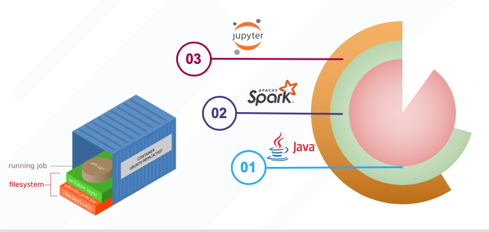

## Docker Example

The docker part is composed by a set of runtimes and components. Then, it is used the docker-compose to start services. This is a good approach when we are developing in a developing environment. 

The first step is to create the runtimes. 

- Runtimes

The runtime has been created in order to optimize the size of the components in execution step. 

The figure shows an overview of the bdaas runtime creation. 




For more information enter in the [Runtime Readme](runtimes/Readme.md) 

- Components

A service is composed by a group of components. These components must be compiled or builded. In the component folder,there are a set of components that must be compiled in order to use with an specific service. In the case of this repository the main image are previously uploaded in the [docker hub registry](https://hub.docker.com/). 

For more information enter in the [Component Readme](components/Readme.md) 


- Services

To execute a particular service, you have first to create a docker-compose and put it as a new service. In case that you would like to use a previusly created services then you have to enter in the service folder and exectute: 

```` 
docker-compose up

````

It starts a services and its containers, wait for a while and then enjoy using the service. 

To scale a component, you have to use the option --scale as follow:

````
 # Enter in the service
 cd jupyterspark

 # start the service and scaling one component. In this case the sparkworker

 
docker-compose up --scale sparkworker=2

````

To access the service, you have to enter using:

```
http://localshost:<portDefined>
```
