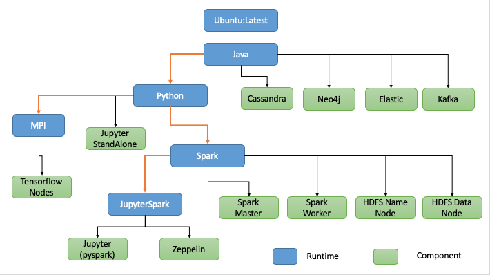

## Runtimes to create the BDaaS on Docker.

This repo tries to design a manner to orchestrate services on the cloud. It will start creating some docker images in order to build the correspoding runtime that will be used for the BigData Technologies. In this case, users must following the runtime structure with the aim of maintaining the compilation scripts and the repository characteristics.  

The runtime dependencies are shown in the figure:



## Compiling all Runtimes

To compile all runtime, you have to execute the following script:

```` 
  runtime/build-runtime.sh
`````

## Downloading Software dependencies

In this repository, I use the configuration of a set of technologies. Some of them are autommatically downloaded from their web. However, there are some installer that users must accept the licence agremment or fill in a form in order to accept the software policy. All the software must be donwloaded to the **runtime/packages** in order to be used in the compilation step. 

- Java

To download the Java Runtime Enviroment ypu have to access to the Oracle Web Site and Donwload the JRE

https://www.oracle.com/technetwork/java/javase/downloads/jre8-downloads-2133155.html

Inside the web, you have to agree the contract and try to download the .tar.gz file.


- Neo4j

Enter into the Neo4j in order to download the installer 

    https://neo4j.com/download-center/#community

Once you have donwloaded the file, enter in the runtime/packages folder and modify or verify the packages version

```
nano runtime/packages/FileVersions.sh

# Edit the following File and search  

# NEO4j 
NEO4J_VERSION="3.5.7"
NEO4J_PACKAGE="neo4j-community-$NEO4J_VERSION-unix.tar.gz"
```
Remember to update the version when you  download a new version.